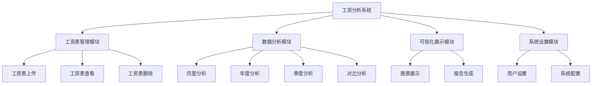

# 工资分析系统页面架构设计

## 模块结构



## 页面设计

### 1. 主页面 (MainPage)
- 底部导航栏包含四个主要功能模块
- 顶部显示系统标题和用户信息

### 2. 工资表管理模块

#### 2.1 工资表上传页面 (UploadPage)
- 文件选择器 (使用file_selector)
- 文件格式验证 (仅支持xlsx)
- 上传进度显示
- 上传结果反馈

#### 2.2 工资表查看页面 (SalaryListPage)
- 按月份筛选已上传的工资表
- 工资表列表展示
- 点击查看详情

#### 2.3 工资表详情页面 (SalaryDetailPage)
- 展示单个工资表的详细信息
- 显示工资记录列表
- 显示汇总信息

### 3. 数据分析模块

#### 3.1 分析维度选择页面 (AnalysisDimensionPage)
- 选择分析维度：月份/年份/季度
- 选择分析时间范围
- 进入具体分析页面按钮

#### 3.2 月度分析页面 (MonthlyAnalysisPage)
- 选择特定月份
- 展示该月工资数据统计
- 关键指标展示

#### 3.3 年度分析页面 (YearlyAnalysisPage)
- 选择特定年份
- 展示该年工资数据趋势
- 年度汇总信息

#### 3.4 季度分析页面 (QuarterlyAnalysisPage)
- 选择特定季度
- 展示该季度工资数据对比
- 季度趋势分析

### 4. 可视化展示模块

#### 4.1 图表展示页面 (ChartPage)
- 多种图表类型展示数据
- 柱状图、折线图、饼图等
- 数据交互功能

#### 4.2 报告生成页面 (ReportPage)
- 生成分析报告
- 报告导出功能
- 报告分享功能

### 5. 系统设置模块

#### 5.1 用户设置页面 (UserSettingsPage)
- 用户信息管理
- 偏好设置

#### 5.2 系统配置页面 (SystemSettingsPage)
- 系统参数配置
- 数据存储设置

## 业务逻辑流程


## 页面文件结构

```
lib/src/pages/
├── main_page.dart                          # 主页面
├── salary_management/                       # 工资表管理模块
│   ├── upload/                             # 上传子模块
│   │   └── upload_page.dart                # 工资表上传页面
│   ├── list/                               # 列表子模块
│   │   └── salary_list_page.dart           # 工资表列表页面
│   └── detail/                             # 详情子模块
│       └── salary_detail_page.dart         # 工资表详情页面
├── data_analysis/                          # 数据分析模块
│   ├── dimension/                          # 维度选择子模块
│   │   └── analysis_dimension_page.dart    # 分析维度选择页面
│   ├── monthly/                            # 月度分析子模块
│   │   └── monthly_analysis_page.dart      # 月度分析页面
│   ├── yearly/                             # 年度分析子模块
│   │   └── yearly_analysis_page.dart       # 年度分析页面
│   └── quarterly/                          # 季度分析子模块
│       └── quarterly_analysis_page.dart    # 季度分析页面
├── visualization/                          # 可视化展示模块
│   ├── chart/                              # 图表子模块
│   │   └── chart_page.dart                 # 图表展示页面
│   └── report/                             # 报告子模块
│       └── report_page.dart                # 报告生成页面
└── settings/                               # 系统设置模块
    ├── user/                               # 用户设置子模块
    │   └── user_settings_page.dart         # 用户设置页面
    └── system/                             # 系统设置子模块
        └── system_settings_page.dart       # 系统设置页面
```